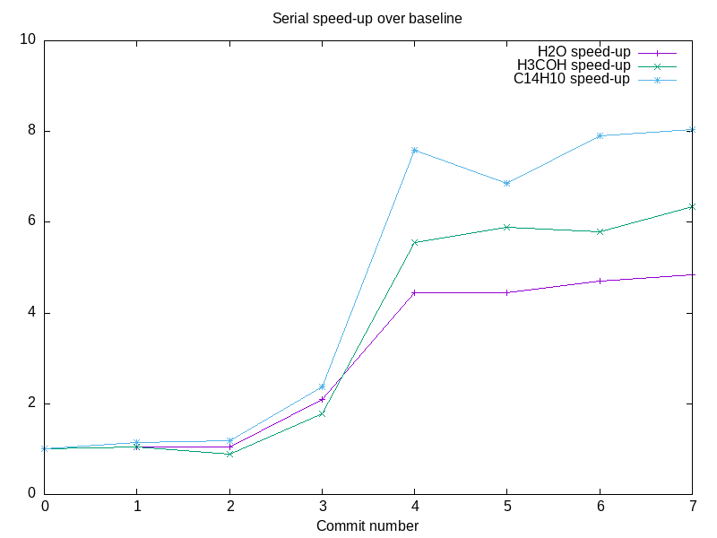
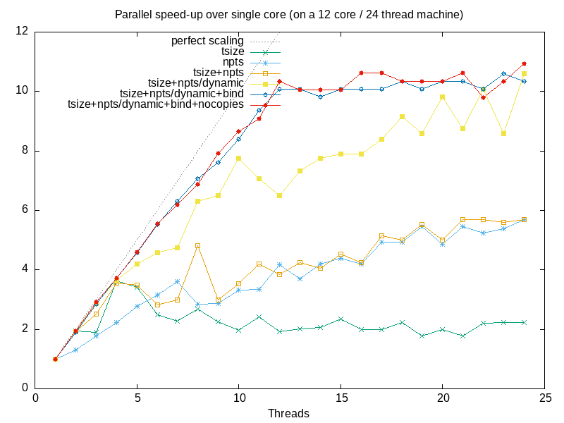

# Performance Engineering Example: libjove 

An example of the counselling the SSC can provide to improve both the serial and parallel performance of a numerical c++ code.

## Overview

This performance-critical piece of code had several opportunities for optimization. With a series of small changes to the code, the single core performance increased by a factor 5, and the algorithm was parallelized with near perfect scaling.

Key concepts used here to increase the serial performance:

- layout data and order loops to avoid cache misses
- use a specialized linear algebra library to generate optimized code

Key concepts used here to increase the parallel performance:

- use a `reduction` pragma to ensure thread safety
- collapse multiple loops to improve scaling for higher numbers of threads
- use `dynamic` scheduling to share uneven workloads equally between threads
- prevent the operating system from moving running threads between cores

## Serial Benchmark history

The serial speed-up from each commit to the repo:

- [0](https://github.com/ssciwr/jove-performance/commit/9759c71ac1fb5fa8c6ac62954063e9bc4c77bbbf): original version
- [1](https://github.com/ssciwr/jove-performance/commit/216392b86444deba72acabcafc2eaaf9624f68b0): transpose data storage order to be more cache friendly
- [2](https://github.com/ssciwr/jove-performance/commit/e5f2c5e3ccff79c6b1da83e442da79169469048b): swap loop order to traverse data in cache friendly way
- [3](https://github.com/ssciwr/jove-performance/commit/a62bb274b8813d3eee01a2bf0d5fd14d57f7e1b7): do half the work by exploiting `p <-> q` symmetry
- [4](https://github.com/ssciwr/jove-performance/commit/cd65939886b61325daa3afce601ba4f182cbd2b5): use [Eigen](https://eigen.tuxfamily.org) instead of Armadillo to generate vectorized code
- [5](https://github.com/ssciwr/jove-performance/commit/d1d4afe2d11b613e0b6ad7611b893c1dc139fedc): refactor to avoid some copies
- [6](https://github.com/ssciwr/jove-performance/commit/7f6c82b51df597af69e6372e90af6c917cf3c27a): refactor to allow parallelization & remove std::cout
- [7](https://github.com/ssciwr/jove-performance/commit/fe269976754d0953cc2dc3c78741b439b99ceeda): avoid hidden copies in armadillo

See the relevant commit message & changes to the code for more details

## Parallel Scaling history

The parallel speed-up from each commit to the repo:

- [tsize](https://github.com/ssciwr/jove-performance/commit/c7411f354d29000b1873b34879918807e2b1462e): parallelize over `tsize`
- [npts](https://github.com/ssciwr/jove-performance/commit/b0e50d49ae245791b63fe7a26b11ad7c0109ecbd): parallelize over `npts`
- [tsize+npts](https://github.com/ssciwr/jove-performance/commit/7f6c82b51df597af69e6372e90af6c917cf3c27a): parallelize over `tsize` and `npts`
- [tsize+npts/dynamic](https://github.com/ssciwr/jove-performance/commit/37efed9c9a05f6db0b11584862fbbd5e9873de3e): parallelize over `tsize` and `npts` + dynamic scheduling
- [tsize+npts/dynamic+bind](https://github.com/ssciwr/jove-performance/commit/ebd7c21a6662b270839c9b71836035ca85836c27): parallelize over `tsize` and `npts` + dynamic scheduling + `export OMP_PROC_BIND=true` to stop OS from moving threads between cores
- [tsize+npts/dynamic+bind+nocopies](https://github.com/ssciwr/jove-performance/commit/fe269976754d0953cc2dc3c78741b439b99ceeda): as above + avoid hidden copies in armadillo

See the relevant commit message & changes to the code for more details

