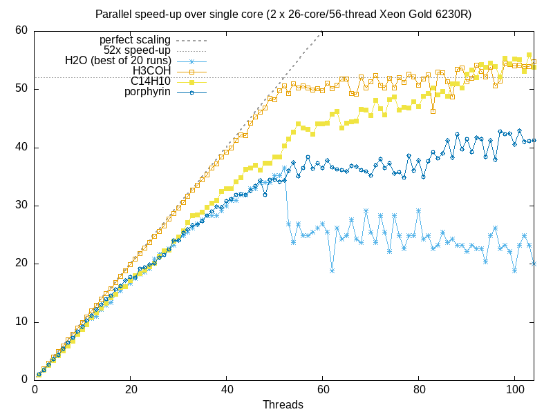

# Performance Engineering Example: libjove 

An example of the counselling the SSC can provide to improve both the serial and parallel performance of a numerical c++ code.

## Overview

This performance-critical piece of code had several opportunities for optimization. With a series of small changes to the code, the single core performance increased by a factor 5, and the algorithm was parallelized with near perfect scaling.

Key concepts used here to increase the serial performance:

- layout data and order loops to avoid cache misses
- use a specialized linear algebra library to generate optimized code

Key concepts used here to increase the parallel performance:

- use a `reduction` pragma to ensure thread safety
- collapse multiple loops to improve scaling for higher numbers of threads
- use `dynamic` scheduling to share uneven workloads equally between threads
- use `OMP_PROC_BIND` to prevent the operating system from moving running threads between cores

## Serial Benchmark history

The serial speed-up from each commit to the repo:

- [0](https://github.com/ssciwr/jove-performance/commit/9759c71ac1fb5fa8c6ac62954063e9bc4c77bbbf): original version
- [1](https://github.com/ssciwr/jove-performance/commit/216392b86444deba72acabcafc2eaaf9624f68b0): transpose data storage order to be more cache friendly
- [2](https://github.com/ssciwr/jove-performance/commit/e5f2c5e3ccff79c6b1da83e442da79169469048b): swap loop order to traverse data in cache friendly way
- [3](https://github.com/ssciwr/jove-performance/commit/a62bb274b8813d3eee01a2bf0d5fd14d57f7e1b7): do half the work by exploiting `p <-> q` symmetry
- [4](https://github.com/ssciwr/jove-performance/commit/cd65939886b61325daa3afce601ba4f182cbd2b5): use [Eigen](https://eigen.tuxfamily.org) instead of Armadillo to generate vectorized code
- [5](https://github.com/ssciwr/jove-performance/commit/d1d4afe2d11b613e0b6ad7611b893c1dc139fedc): refactor to avoid some copies
- [6](https://github.com/ssciwr/jove-performance/commit/7f6c82b51df597af69e6372e90af6c917cf3c27a): refactor to allow parallelization & remove std::cout
- [7](https://github.com/ssciwr/jove-performance/commit/fe269976754d0953cc2dc3c78741b439b99ceeda): avoid hidden copies in armadillo

See the relevant commit message & changes to the code for more details

## Parallel Scaling history

The parallel speed-up from each commit to the repo:

- [tsize](https://github.com/ssciwr/jove-performance/commit/c7411f354d29000b1873b34879918807e2b1462e): parallelize over `tsize`
- [npts](https://github.com/ssciwr/jove-performance/commit/b0e50d49ae245791b63fe7a26b11ad7c0109ecbd): parallelize over `npts`
- [tsize+npts](https://github.com/ssciwr/jove-performance/commit/7f6c82b51df597af69e6372e90af6c917cf3c27a): parallelize over `tsize` and `npts`
- [tsize+npts/dynamic](https://github.com/ssciwr/jove-performance/commit/37efed9c9a05f6db0b11584862fbbd5e9873de3e): parallelize over `tsize` and `npts` + dynamic scheduling
- [tsize+npts/dynamic+bind](https://github.com/ssciwr/jove-performance/commit/ebd7c21a6662b270839c9b71836035ca85836c27): parallelize over `tsize` and `npts` + dynamic scheduling + `export OMP_PROC_BIND=true` to stop OS from moving threads between cores
- [tsize+npts/dynamic+bind+nocopies](https://github.com/ssciwr/jove-performance/commit/fe269976754d0953cc2dc3c78741b439b99ceeda): as above + avoid hidden copies in armadillo

See the relevant commit message & changes to the code for more details

## Parallel Scaling

The parallel scaling for various sets of test data, on a server with 2x 26-core/52-thread Xeon Gold 6230R CPUs.

### Minimal relevant background on cache & hyperthreading

- cpus are much faster than memory, so they cache data
  - each cpu core has its own cache (a tiny amount of very very fast memory)
  - all cpu cores also share a larger cache (about 30MB of very fast memory)
  - main memory (RAM) is much larger, but also much slower
- a cpu core looks for data in its cache -> if not found, in shared cache -> if not found, in main memory
  - going all the way to main memory is about 100x slower than having it in its own cache
  - this is a "cache miss", and means the core waits around doing nothing until the data is transferred
- to avoid this waiting, these cores support two threads per core (hyperthreading)
  - only one thread can be running on the core at a given time
  - but if one has to wait because of a cache miss, the other can run in the meantime
  - if every instruction is a cache miss, this doesn't help, since both threads are waiting for data
  - if every instruction is a cache hit, it also doesn't help, since there is no spare cpu time to run the second thread
  - if there are a mix of hits and misses, then it can improve performance

### Analysis of scaling results

| dataset   | matrix size | number | approx MB |
| --------- | ----------- | ------ | --------- |
| H2O       | 13 x 13     | 2280   | 1         |
| H3COH     | 26 x 26     | 4560   | 12        |
| C14H10    | 146 x 146   | 18240  | 1500      |
| PORPHYRIN | 244 x 244   | 28880  | 6600      |

The `H2O` dataset scales well for the first few threads, then drops off,
and adding more threads than cores actually makes the run time worse.
This is likely due to the overhead of dynamic scheduling,
which is non-negligible for this dataset since the entire
benchmark only takes a few tens of milliseconds to run.

The `H3COH` dataset exhibits near-perfect scaling until the number of threads is equal to the number of cores.
This makes sense, as all the data fits into cache, so there should be very few cache misses regardless of the 
number of threads used, so adding threads linearly improves performance up to the number of cores, and beyond that
has no effect on performance. 

For the `C14H10` dataset the data is much larger than the cache, so we see sub-linear scaling as the number of
threads increases, most likely due to increased cache misses. Because of these cache misses, we do now see an improvement
in the performance when the number of threads is increased beyond the number of cores. The final speed up using
all threads is approximately equal to the number of physical cores.

*Note: On this machine we do `export OMP_PROC_BIND=spread` for the scaling test, otherwise OpenMP tends to assign threads to hyperthreads instead of physical cores. Also turbo boost has been disabled.*
