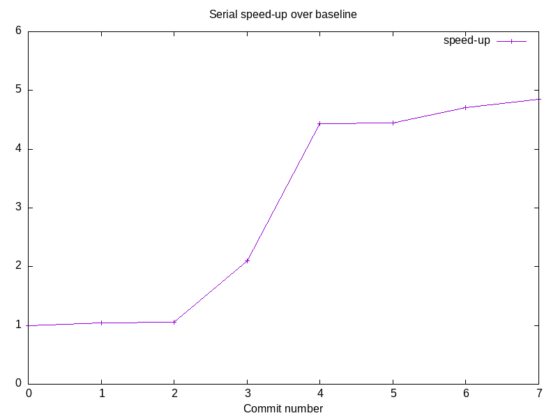
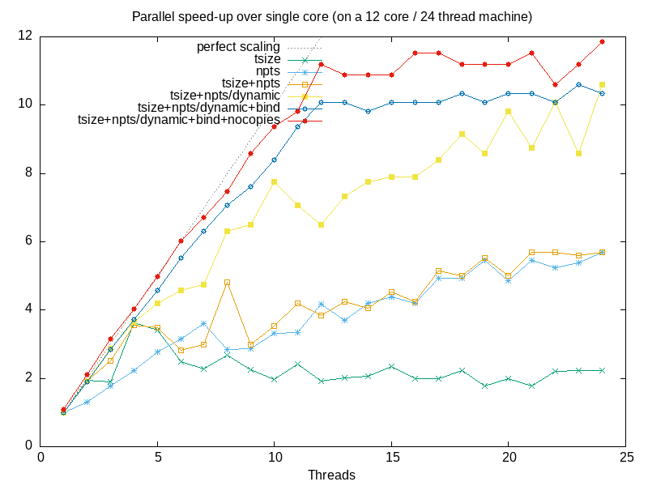

# libjove

Working GIT of the JOVE (high-performance parallelization of QC calculations through grid quadrature) Project at the Dreuw Group
This library should be stand-alone if armadillo is installed. Use the do_configure script to set up your cmake environment. 

TODOs:
- implement omni-grid class 
- implement simple 3d grid for visualization (?)
- new parallelization scheme
- HPC ready

## Benchmark history

The serial speed-up from each commit to the repo:

- [0](https://github.com/ssciwr/jove-performance/commit/301456c5f643a935abef0628a5edc8eb1f8b1b35): original version
- [1](https://github.com/ssciwr/jove-performance/commit/f87ef27788cc33d5cceb1764b3526e7d9919e983): transpose data storage order to be more cache friendly
- [2](https://github.com/ssciwr/jove-performance/commit/e3bf8948cf872f88556be4e5facfc130fad8fad1): swap loop order to traverse data in cache friendly way
- [3](https://github.com/ssciwr/jove-performance/commit/b12d8e45c3533d69f2f02c5e2ecd924eab1299d4): do half the work by exploiting `p <-> q` symmetry
- [4](https://github.com/ssciwr/jove-performance/commit/eb5d88e977ab9e25f9d67640c25690c57575029a): use [Eigen](https://eigen.tuxfamily.org) instead of Armadillo to generate vectorized code
- [5](https://github.com/ssciwr/jove-performance/commit/6e44a30dc6f18f9f8faf02e99e7f9b7d8c874eb1): refactor to avoid some copies

See the relevent commit message & changes to the code for more details

The parallel speed-up from each commit to the repo:

- [tsize](https://github.com/ssciwr/jove-performance/commit/ad5555cd3a866fe4f5891a0213fce31b440d477b): parallelize over `tsize`
- [npts](https://github.com/ssciwr/jove-performance/commit/6f09110046bd1ca68a2d736ab77a65e66d59357a): parallelize over `npts`
- [tsize+npts/dynamic](https://github.com/ssciwr/jove-performance/commit/3175db052060d1a4287347a811e91b8c0fbd6354): parallelize over `tsize` and `npts` + dynamic scheduling
- [tsize+npts/dynamic](https://github.com/ssciwr/jove-performance/commit/612ac17b12164577cb386a9e474cd3a269e7c9ae): parallelize over `tsize` and `npts`, balance inner loop + static scheduling
 + dynamic scheduling

See the relevent commit message & changes to the code for more details

